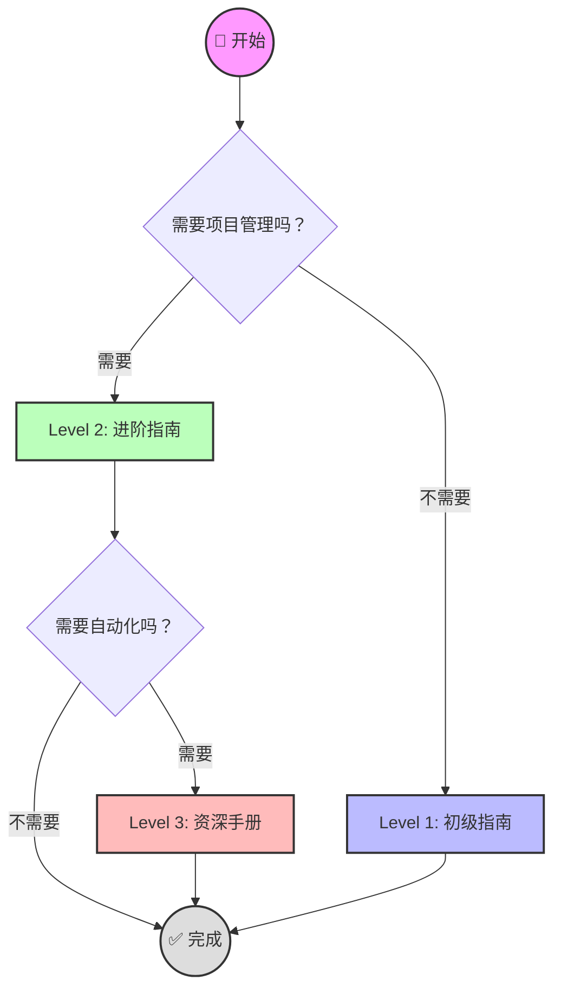

# 🚀 开始使用 FlowOS (Start Here)

欢迎来到 FlowOS！这是一个为你设计的**渐进式任务管理系统**。

我们不想让你一开始就被复杂的系统吓跑。请根据你的需求，选择适合你的等级。

---

## 🗺️ 你的旅程 (Choose Your Path)

---

## 🚦 选择你的等级 (Select Level)

### [[01-初级指南|Level 1: 初级指南 (Beginner)]]
> **适合人群**：只需要简单的日记和待办事项，不喜欢折腾。
> **主要功能**：`05-日记` (日记), `00-收集箱` (收集箱)。
> **耗时**：1 分钟。

### [[02-进阶指南|Level 2: 进阶指南 (Advanced)]]
> **适合人群**：需要管理多个项目，按照 PARA 方法论分类任务。
> **主要功能**：`10-项目` (项目), `20-领域` (领域)。
> **耗时**：5 分钟。

### [[03-资深手册|Level 3: 资深手册 (Expert)]]
> **适合人群**：极客玩家，喜欢自动化脚本和 Dataview 查询。
> **主要功能**：`90-模版` (模版), `scripts/` (脚本), `Dashboard` (仪表盘)。
> **耗时**：10 分钟+。

---

## 🛠️ 快速链接 (Quick Links)

- **[[Dashboard|📊 仪表盘]]**: 查看所有任务的总览。
- **[[00-收集箱/Inbox|📥 收集箱]]**: 快速记录想法。
- **[[99-手册/02-参考手册/完整用户手册|📖 完整手册]]**: 查阅详细文档。
