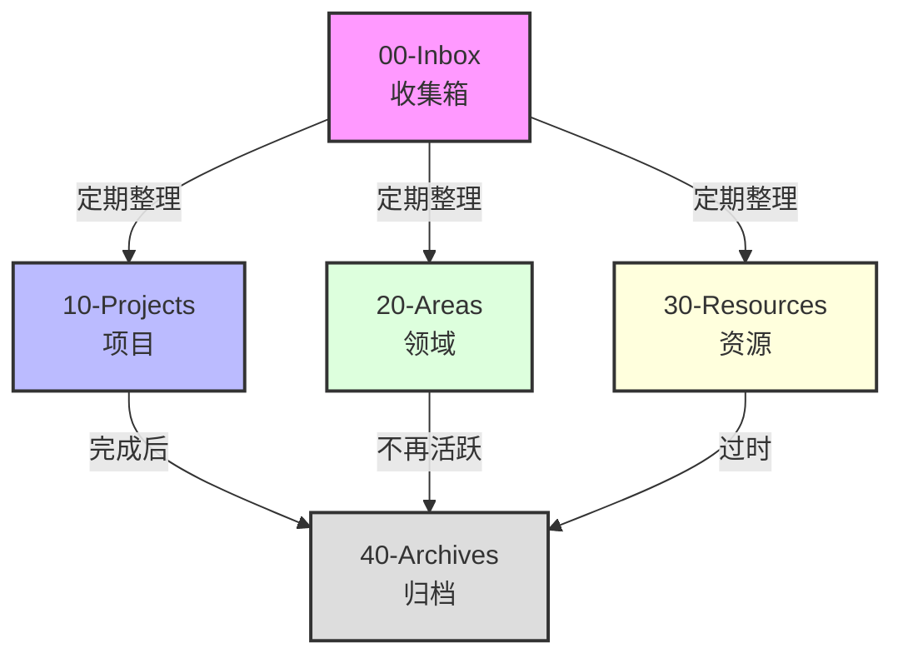
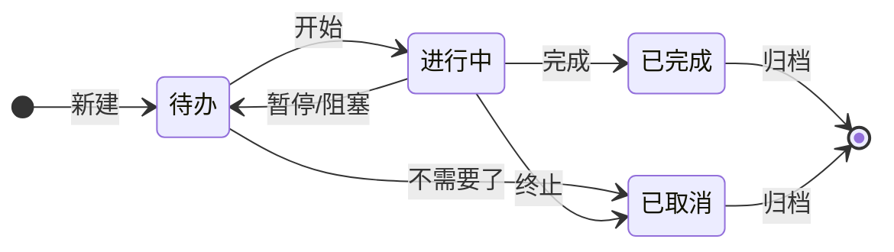

# 完整用户手册

## 1. 系统架构 (System Architecture)

本系统基于 **PARA** 方法论构建，旨在实现任务与知识的高效管理。

### 文件夹结构



*   **00-Inbox (收集箱)**
    *   **用途**: 临时存放未分类的想法、任务和笔记。
    *   **操作**: 所有新内容默认先放入此文件夹，定期（如每日/每周）整理分发到其他文件夹。
*   **10-Projects (项目)**
    *   **用途**: 存放具有明确截止日期和具体目标的任务集合。
    *   **示例**: "发布 v1.0 版本"、"撰写年度报告"。
    *   **状态**: 活跃的项目在此处进行管理。
*   **20-Areas (领域)**
    *   **用途**: 需要长期维护的责任领域，没有明确截止日期。
    *   **示例**: "健康"、"财务"、"职业发展"。
*   **30-Resources (资源)**
    *   **用途**: 感兴趣的主题或未来可能用到的参考资料。
    *   **示例**: "设计素材"、"Python 教程"。
*   **40-Archives (归档)**
    *   **用途**: 存放已完成的项目或不再活跃的领域/资源。
    *   **原则**: 保持活跃目录的整洁，历史记录存放在此。
*   **90-Templates (模版)**
    *   **用途**: 存放笔记和项目的标准化模版。
    *   **示例**: [日记模版](../90-Templates/日记模版.md)、[项目模版](../90-Templates/项目模版.md)。
*   **99-Manual (手册)**
    *   **用途**: 存放系统使用说明和指南（即本文件夹）。

---

## 2. 插件使用指南 (Plugin Usage)

### Tasks 插件

用于管理具体的待办事项。

*   **基本语法**:
    *   在 Obsidian 中输入 `- [ ]` 即可创建一个任务。
    *   使用命令面板 (Cmd+P) 搜索 "Tasks: Create or edit task" 可以更方便地添加属性。
*   **优先级 (Priority)**:
    *   ⏫ **高优先级** (High): 紧急且重要。
    *   🔼 **中优先级** (Medium): 重要但不紧急。
    *   🔽 **低优先级** (Low): 不重要。
    *   示例: `- [ ] 这是一个高优先级任务 ⏫`
*   **截止日期 (Due Date)**:
    *   📅 **格式**: `YYYY-MM-DD`
    *   示例: `- [ ] 这是一个明天截止的任务 📅 2024-05-20`
*   **查询 (Queries)**:
    *   在 [Dashboard.md](../Dashboard.md) 中，我们使用了 Tasks 查询来展示：
        *   **High Priority Tasks**: 查询所有未完成且优先级为高的任务。
        *   **Overdue Tasks**: 查询所有未完成且截止日期在今天之前的任务。

### Dataview 插件

用于动态展示库中的数据。

*   **Dashboard 原理**:
    *   在 [Dashboard.md](../Dashboard.md) 中，我们使用 Dataview 查询来生成 "Active Projects" 表格。
    *   **代码解释**:
        ```sql
        TABLE status, priority
        FROM "10-Projects"
        WHERE status != "completed" AND file.name != "10-Projects"
        ```
        *   `TABLE status, priority`: 展示 status 和 priority 两列
        *   `FROM "10-Projects"`: 数据来源：10-Projects 文件夹
        *   `WHERE status != "completed"`: 过滤条件：状态不等于 "completed"
        *   `AND file.name != "10-Projects"`: 排除文件夹索引文件本身
    *   这意味只要你在 `10-Projects` 文件夹下的笔记中定义了 `status` 属性（YAML frontmatter），它就会自动出现在仪表盘中。

### Kanban 插件

用于可视化项目管理。

*   **使用方法**:
    *   打开 [活跃项目看板.md](../10-Projects/活跃项目看板.md)。
    *   这是一个看板视图，包含 **Todo** (待办)、**In Progress** (进行中)、**Done** (已完成) 三个列表。
    *   **操作**:
        *   **添加任务**: 在任意列底部点击 "Add a card"。
        *   **移动任务**: 直接拖拽卡片在不同状态列之间移动。
        *   **关联笔记**: 卡片可以是纯文本，也可以是链接到具体项目笔记的链接 `[[项目名称]]`。

---

## 3. 工作流 (Workflows)

### 任务生命周期 (Task Lifecycle)



### 项目生命周期 (Project Lifecycle)

1.  **启动 (Initiation)**:
    *   在 `00-Inbox` 中捕捉想法。
    *   确认转化为项目后，在 `10-Projects` 中创建新笔记（可使用 [项目模版](../90-Templates/项目模版.md)）。
    *   在笔记的 YAML 区域设置 `status: active`。
    *   将项目添加到 [活跃项目看板.md](../10-Projects/活跃项目看板.md) 的 "Todo" 列。
2.  **执行 (Execution)**:
    *   在看板中将项目拖动到 "In Progress"。
    *   在项目笔记中拆解具体任务（使用 Tasks 语法）。
    *   每天查看 [Dashboard.md](../Dashboard.md) 处理高优先级任务。
3.  **结项 (Completion)**:
    *   项目完成后，在看板中拖动到 "Done"。
    *   将项目笔记的 YAML 状态改为 `status: completed`（此时它会自动从 Dashboard 消失）。
    *   将项目笔记移动到 `40-Archives` 文件夹。

### 周期性回顾 (Reviews)

*   **每日回顾 (Daily Review)**:
    *   查看 [Dashboard.md](../Dashboard.md)。
    *   清空 `00-Inbox`（如果有新内容）。
    *   检查 "Overdue Tasks" 并重新安排时间。
    *   挑选 1-3 个 "High Priority Tasks" 作为今日重点。
*   **每周回顾 (Weekly Review)**:
    *   检查 `10-Projects` 中的所有活跃项目，确保进度正常。
    *   检查 `20-Areas`，看是否有需要转为项目的事务。
    *   更新 [活跃项目看板.md](../10-Projects/活跃项目看板.md)。
    *   清理电脑桌面和下载文件夹，归档到 `00-Inbox` 或删除。

---

## 4. 维护 (Maintenance)

### 备份 (Backup)

*   **重要性**: 数据无价，请务必定期备份。
*   **方法**:
    1.  **云同步**: 使用 iCloud Drive, Dropbox, 或 OneDrive 同步整个 `任务管理` 文件夹。
    2.  **Git 版本控制**: (如果熟悉) 在根目录初始化 Git 仓库，定期 commit 和 push 到 GitHub/GitLab 私有仓库。
    3.  **本地快照**: 定期将整个文件夹复制到外部硬盘。

### 归档 (Archive)

*   当 `10-Projects` 中的项目完成，或 `20-Areas` 中的领域不再关注时，请将其移动到 `40-Archives`。
*   **建议**: 按年份在 `40-Archives` 下建立子文件夹（如 `40-Archives/2024`），以便于未来查找。
