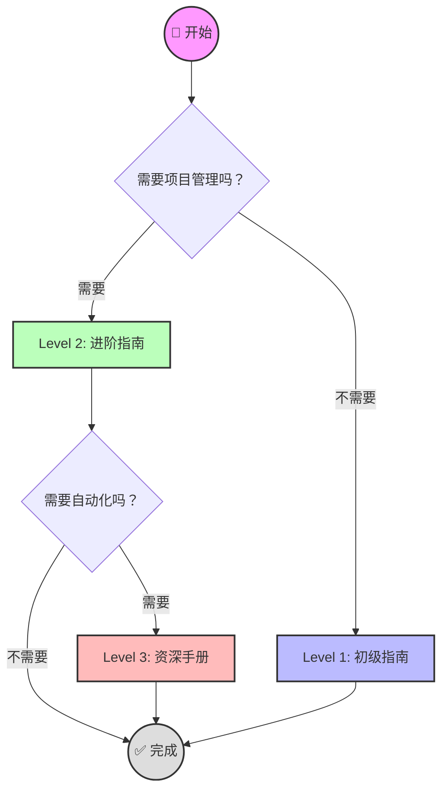

# 🚀 开始使用 FlowOS (Start Here)

> [!quote] 欢迎来到 FlowOS
> 这是一个为你设计的**渐进式任务管理系统**。我们不想让你一开始就被复杂的系统吓跑。请先去新手乐园体验一下，然后再根据你的需求选择适合的等级。

## 🎡 第一站：去乐园玩耍！
如果你是第一次来，强烈建议你先花 1 分钟去玩一下这个沙盒，它会教会你所有的基础操作（打勾、设置日期、调整优先级）：
👉 **[[00-新手乐园(Playground)]]**

---

## 🗺️ 你的旅程 (Choose Your Path)

> [!info] 进阶路径
> 如果你已经掌握了基础操作，可以看看下面不同等级的教程，选择最适合你当前状态的路径。

---

## 🚦 详细指南 (Guides)

### [[01-初级指南|Level 1: 初级指南 (Beginner)]]
> **适合人群**：只需要简单的日记和待办事项，不喜欢折腾。
> **主要功能**：`05-日记` (日记), `00-收集箱` (收集箱)。
> **耗时**：1 分钟。

### [[02-进阶指南|Level 2: 进阶指南 (Advanced)]]
> **适合人群**：需要管理多个项目，按照 PARA 方法论分类任务。
> **主要功能**：`10-项目` (项目), `20-领域` (领域)。
> **耗时**：5 分钟。

### [[03-资深手册|Level 3: 资深手册 (Expert)]]
> **适合人群**：极客玩家，喜欢自动化脚本和 Dataview 查询。
> **主要功能**：`90-模版` (模版), `scripts/` (脚本)。
> **耗时**：10 分钟+。

---

## 🧹 保持整洁 (Keep it Clean)

> [!tip] 定期归档
> 随着系统的使用，内容会越来越多。为了保持工作区的整洁和高效，建议定期将不再活跃的项目、笔记和日记进行归档。
> 👉 **详情请参考：[[05-归档与整理指南]]**

---

## 📚 专题指南 (Special Guides)

除了按阶段划分的指南，如果你想深入了解某个特定的功能，可以参考以下专题：
- **[[04-日历使用指南]]**: 学习如何使用日历插件管理日程和周复盘。
- **[[06-属性管理指南]]**: 学习如何优雅地管理笔记的属性（元数据），并与 Dataview 联动。
- **[[快速上手备忘]]**: 快速回顾常用的快捷键、模版和工作流。

---

## 🛠️ 快速链接 (Quick Links)

- **[[Dashboard|📊 仪表盘]]**: 你的日常控制中心。
- **[[00-收集箱/Inbox|📥 收集箱]]**: 快速记录灵感。
- **[[99-手册/02-参考手册/完整用户手册|📖 完整手册]]**: 查阅详细文档。
