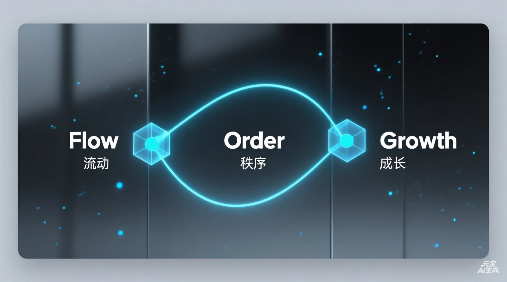

# FlowOS v1.1

## 简介 (Introduction)

FlowOS 是一个基于 Obsidian 构建的个人任务和知识管理系统 (Life OS)。它旨在帮助你高效地管理任务、项目和知识，将收集、整理和输出无缝连接，打造一体化的工作流。

## 系统要求 (Requirements)

为了获得最佳体验，请确保安装并启用以下核心插件：

*   **Dataview**: 用于生成动态列表和报表。
*   **Tasks**: 用于任务管理和复选框增强。
*   **Kanban**: 用于项目看板视图。
*   **Advanced URI**: **(必需)** 用于 Dashboard 上的快速操作按钮（如“新建任务”、“写日记”）。

## 主要特性 (Key Features)

基于[用户故事与旅程](./99-手册/03-设计文档/用户故事与旅程.md)的设计，FlowOS 提供以下核心功能：

*   **每日规划 (Daily Planning)**
    *   统一界面查看待办事项和日历安排。
    *   快速规划当日工作重点，避免遗漏重要任务。

*   **项目管理 (Project Management)**
    *   通过看板视图直观展示任务状态（待办、进行中、已完成）。
    *   助力项目经理和知识工作者掌握进度，按时交付。

*   **知识归档 (Knowledge Base)**
    *   系统化管理学习资料和项目文档。
    *   一键归档，保持工作区整洁，方便未来复习与查找。

*   **全流程支持 (Workflow Support)**
    *   **每日工作流**: 涵盖从早晨启动、专注工作、灵感记录到晚间回顾的完整闭环。
    *   **每周回顾**: 提供数据统计与反思模板，帮助持续改进工作效率。

## 快速开始 (Quick Start)

请查看 **[开始使用](./99-手册/01-指南/00-开始使用.md)** 文档以快速上手 FlowOS 系统。

## 目录结构 (Structure)

FlowOS 采用清晰的目录结构来组织内容：

*   **00-收集箱**: 收集箱。存放所有未分类的想法、临时任务和稍后阅读的内容。
*   **05-日记**: 每日日记。按日期自动归档的每日工作记录和流水账。
*   **10-项目**: 项目文件夹。存放具体项目的笔记、看板和相关文档（具有明确截止日期）。
*   **20-领域**: 领域文件夹。存放长期关注的责任领域（如健康、财务、技能学习）。
*   **40-归档**: 归档目录。存放不再活跃的项目、笔记和日记。
*   **90-模版**: 模版文件夹。包含日记、项目、周回顾等标准模版。
*   **99-手册**: 用户手册。存放系统的详细使用指南、设计文档和参考资料。

## 升级与维护 (Upgrade & Maintenance)

FlowOS 提供了**一键升级**功能，让您轻松保持系统最新。

- **Mac/Linux 用户**: 双击根目录下的 `⬆️双击升级.command`
- **Windows 用户**: 双击根目录下的 `⬆️双击升级.bat`

升级过程会自动备份您的数据，并尝试自动迁移旧版本结构，确保您的个人笔记安全无忧。如果遇到问题，还可以使用 `⏪双击回滚` 脚本恢复到之前的状态。

## 产品规划 (Product Roadmap)

作为持续演进的产品，FlowOS 拥有清晰的发展路线图。

### 1. 产品评估 (Product Review)

#### 核心价值主张 (Core Value Proposition)
- **本地优先 (Local-first)**: 所有数据存储在本地，确保隐私和安全。
- **数据所有权 (Data ownership)**: 用户完全掌控自己的数据，不依赖云端服务。
- **高度可定制 (Highly customizable)**: 基于 Obsidian 构建，支持丰富的插件和主题，满足个性化需求。

#### 当前痛点 (Current Pain Points)
- **上手难度大 (Onboarding is steep)**: 对于非技术用户来说，配置和学习曲线较陡峭。
- **移动端体验需改进 (Mobile experience needs work)**: 相比桌面端，移动端的交互和功能体验有待提升。
- **自动化受限 (Automation is limited)**: 目前的自动化流程还不够强大，需要更多集成。

#### 改进建议 (Improvement Suggestions)
- **更好的模板 (Better templates)**: 提供开箱即用的优质模板，降低入门门槛。
- **更多自动化脚本 (More automation scripts)**: 开发更多实用的脚本，提升工作流效率。
- **改进文档 (Improved documentation)**: 完善使用文档和教程，帮助用户更快掌握。

### 2. 演进路线图 (Roadmap)

1. **短期 (v1.2)**: 用户体验优化 & 新手引导 (模版, 指南)
2. **中期 (v1.3)**: 自动化 & 集成 (脚本, API)
3. **长期 (v2.0)**: 智能化 & 云服务 (AI, 同步)
